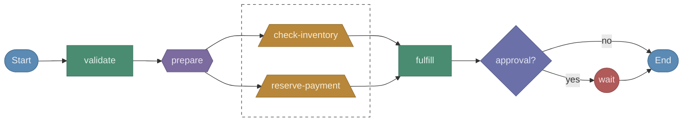

# durable-viz

[](https://www.npmjs.com/package/durable-viz)
[](https://marketplace.visualstudio.com/items?itemName=gunnargrosch.durable-viz)
[](https://github.com/gunnargrosch/durable-viz/actions/workflows/ci.yml)
[](https://www.typescriptlang.org/)
[](https://nodejs.org/)
[](https://opensource.org/licenses/MIT)

Visualize [AWS Lambda Durable Functions](https://docs.aws.amazon.com/lambda/latest/dg/durable-functions.html) workflows. Static analysis turns your handler code into a flowchart, no deployment or execution required.

Supports **TypeScript/JavaScript**, **Python**, and **Java** runtimes.



## Table of Contents

- [Quick Start](#quick-start)
- [VS Code Extension](#vs-code-extension)
- [CLI Reference](#cli-reference)
- [Supported Primitives](#supported-primitives)
- [How It Works](#how-it-works)
- [Examples](#examples)
- [Project Structure](#project-structure)
- [Limitations](#limitations)
- [Contributing](#contributing)
- [License](#license)

## Quick Start

Run against any file containing a durable function handler:

```shell
npx durable-viz examples/order-workflow.ts --open
```

This parses the handler, extracts the workflow structure, and opens an interactive diagram in your browser.

Try the included examples:

```shell
# TypeScript
npx durable-viz examples/order-workflow.ts --open

# Python
npx durable-viz examples/order_processor.py --open

# Java
npx durable-viz examples/OrderProcessor.java --open
```

## VS Code Extension

The extension renders the workflow diagram in a side panel next to your code.

### Install from Marketplace

[Install from VS Code Marketplace](https://marketplace.visualstudio.com/items?itemName=gunnargrosch.durable-viz) or [open directly in VS Code](vscode:extension/gunnargrosch.durable-viz).

You can also search **"Durable Viz"** in the Extensions panel, or run:

```shell
ext install gunnargrosch.durable-viz
```

### Install from Source

```shell
cd packages/vscode
pnpm build
npx @vscode/vsce package --no-dependencies
code --install-extension durable-viz-*.vsix
```

### Usage

1. Open a file containing a durable function handler.
2. Open the command palette (`Ctrl+Shift+P` / `Cmd+Shift+P`).
3. Run **Durable Viz: Open Lambda Durable Function Workflow**.

The diagram appears in a side panel. It auto-refreshes when you save the file.

### Features

| Feature | Description |
| --- | --- |
| **Scroll zoom** | Scroll wheel to zoom in/out, zooms toward cursor |
| **Click-drag pan** | Click and drag to move around the diagram |
| **Click-to-navigate** | Click any node to jump to that line in the source file |
| **Auto-refresh** | Diagram updates on file save |
| **Fit to view** | Fit button and auto-fit on open |

The extension activates for `.ts`, `.js`, `.py`, and `.java` files. A toolbar button also appears in the editor title bar for these file types.

## CLI Reference

```
Usage: durable-viz [options] <file>

Arguments:
  file                  Path to a durable function handler file

Options:
  -d, --direction <dir> Graph direction: TD (top-down) or LR (left-right) (default: "TD")
  -n, --name <name>     Override the workflow name
  --json                Output the raw workflow graph as JSON
  -o, --open            Open the diagram in your browser
  -V, --version         Output the version number
  -h, --help            Display help
```

### Output Formats

**Mermaid** (default) prints Mermaid flowchart syntax to stdout. Paste into GitHub Markdown, Notion, or any Mermaid-compatible renderer.

```shell
durable-viz handler.ts
```

**Browser** generates a self-contained HTML file and opens it. Includes dark theme, zoom controls, and color legend.

```shell
durable-viz handler.ts --open
```

**JSON** outputs the raw workflow graph (nodes, edges, source lines) for custom tooling.

```shell
durable-viz handler.ts --json
```

## Supported Primitives

The parser detects all durable execution SDK primitives across all three runtimes:

| Primitive | TypeScript | Python | Java |
| --- | --- | --- | --- |
| Step | `context.step()` | `context.step()` | `ctx.step()` |
| Invoke | `context.invoke()` | `context.invoke()` | `ctx.invoke()` |
| Parallel | `context.parallel()` | `context.parallel()` | `ctx.parallel()` |
| Map | `context.map()` | `context.map()` | `ctx.map()` |
| Wait | `context.wait()` | `context.wait()` | `ctx.wait()` |
| Wait for Callback | `context.waitForCallback()` | `context.wait_for_callback()` | `ctx.waitForCallback()` |
| Create Callback | `context.createCallback()` | `context.create_callback()` | `ctx.createCallback()` |
| Wait for Condition | `context.waitForCondition()` | `context.wait_for_condition()` | `ctx.waitForCondition()` |
| Child Context | `context.runInChildContext()` | `context.run_in_child_context()` | `ctx.runInChildContext()` |

TypeScript also detects `context.promise.all()`, `context.promise.any()`, `context.promise.race()`, and `context.promise.allSettled()`.

### Visual Encoding

Each primitive type has a distinct shape and color in the diagram:

| Node | Shape | Color |
| --- | --- | --- |
| Start / End | Stadium | Blue |
| Step | Rectangle | Green |
| Invoke | Trapezoid | Amber |
| Parallel / Map | Hexagon | Purple |
| Wait / Callback | Circle | Red |
| Condition | Diamond | Indigo |
| Child Context | Subroutine | Teal |

## How It Works

The tool performs static analysis on your source file. It never imports, executes, or deploys your code.

### TypeScript / JavaScript

Uses [ts-morph](https://github.com/dsherret/ts-morph) to parse the AST. Finds `withDurableExecution()` calls, walks the handler body, and extracts durable primitives with their names, options, and source locations.

**Advanced features** (TypeScript only):

- **Function-reference following.** If the handler calls a helper function that accepts `DurableContext`, the parser resolves it and inlines its durable calls at the call site.
- **Registry key resolution.** For dynamic `context.parallel()` calls using `.map()` over a registry object (like a specialist map), the parser enumerates the registry keys to show all possible parallel branches.

### Python

Regex-based parser. Finds `@durable_execution` decorated handlers and extracts `context.<method>()` calls with their `name=` keyword arguments.

### Java

Regex-based parser. Finds classes extending `DurableHandler` and extracts `ctx.<method>()` calls from the `handleRequest` method with their string literal names.

### Conditionals

All three parsers detect `if` statements that wrap durable calls and represent them as condition (diamond) nodes in the graph. When the `if` block ends with a `return`, the "yes" branch connects to End instead of falling through.

## Examples

The `examples/` directory contains sample handlers for each language:

| File | Language | Primitives |
| --- | --- | --- |
| `order-workflow.ts` | TypeScript | step, parallel, invoke, waitForCallback, condition |
| `order_processor.py` | Python | step, wait, create_callback, invoke, condition |
| `OrderProcessor.java` | Java | step, wait, invoke, waitForCallback, condition |

```shell
npx durable-viz examples/order-workflow.ts --open
```

## Project Structure

```
durable-viz/
  packages/
    core/                         # Parser + graph model + renderers
      src/
        parser.ts                 # Parser interface + dispatch by extension
        parsers/
          typescript.ts           # TypeScript/JS parser (ts-morph AST)
          python.ts               # Python parser (regex)
          java.ts                 # Java parser (regex)
        graph.ts                  # WorkflowGraph model + edge builder
        renderers/
          mermaid.ts              # Mermaid flowchart renderer
        index.ts                  # Public API
    cli/                          # npx CLI
      src/
        bin.ts                    # CLI entry point + browser HTML template
    vscode/                       # VS Code extension
      src/
        extension.ts              # Webview panel + click-to-navigate
  examples/                       # Sample handlers for each language
  pnpm-workspace.yaml
  tsconfig.base.json
```

### Architecture

The core package is language-agnostic above the parser layer. Adding a new language means implementing the `Parser` interface (two methods: `extensions` and `parseFile`). The graph model, edge builder, and all renderers are shared.

```
[source file] → Parser → WorkflowGraph → Renderer → [output]
                  │                          │
          TypeScript / Python / Java    Mermaid / JSON
```

## Limitations

- **Same-file only.** Function-reference following resolves functions defined in the same file. Imported helpers from other files are not followed.
- **Static analysis.** The parser sees all possible paths, not a specific execution. Dynamic parallel branches (from `.map()`) show all registered targets, even if a given execution only uses a subset.
- **Mermaid rendering.** Arrow routing for fan-in (multiple edges converging on one node) is controlled by Mermaid's layout engine. Complex workflows with many parallel branches may have overlapping edges.
- **Java SDK preview.** The Java durable execution SDK is in preview. Some primitives (`waitForCondition`, `waitForCallback`, `parallel`, `map`) may not be available yet.
- **Python/Java parsers are regex-based.** They handle standard patterns well but may miss unusual formatting (e.g., method calls split across many lines with comments between arguments).

## Contributing

Contributions are welcome. To set up the development environment:

```shell
git clone https://github.com/gunnargrosch/durable-viz.git
cd durable-viz
pnpm install
pnpm build
```

Run the CLI locally:

```shell
node packages/cli/dist/bin.js examples/order-workflow.ts --open
```

Test the VS Code extension by pressing `F5` in the `packages/vscode` directory to launch the Extension Development Host.

## License

MIT
