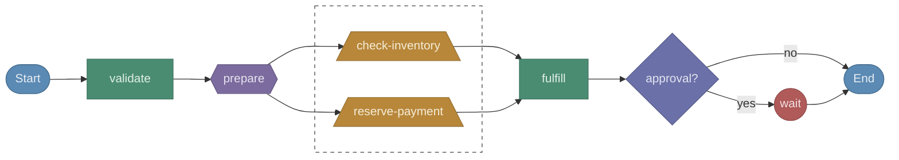

# durable-viz

[](https://www.npmjs.com/package/durable-viz)
[](https://marketplace.visualstudio.com/items?itemName=gunnargrosch.durable-viz)
[](https://open-vsx.org/extension/gunnargrosch/durable-viz)
[](https://github.com/gunnargrosch/durable-viz/actions/workflows/ci.yml)
[](https://www.typescriptlang.org/)
[](https://nodejs.org/)
[](https://opensource.org/licenses/MIT)

Visualize and build [AWS Lambda Durable Functions](https://docs.aws.amazon.com/lambda/latest/dg/durable-functions.html) workflows. Turn your handler code into a flowchart, or design a workflow from scratch and generate boilerplate code — no deployment or execution required.

Supports **TypeScript/JavaScript**, **Python**, **Java**, **C# (.NET)**, **Rust**, and **Go** runtimes.


```mermaid
graph LR
  node_start([Start])
  step_1[validate]
  parallel_2{{prepare}}
  subgraph sub_parallel_2[" "]
    invoke_3[/check-inventory\]
    invoke_4[/reserve-payment\]
  end
  style sub_parallel_2 fill:transparent,stroke:#444,stroke-width:1px,stroke-dasharray:5 5
  step_5[fulfill]
  cond_6{approval?}
  callback_7((wait))
  node_end([End])
  node_start --> step_1
  step_1 --> parallel_2
  parallel_2 --> invoke_3
  parallel_2 --> invoke_4
  invoke_3 --> step_5
  invoke_4 --> step_5
  step_5 --> cond_6
  cond_6 -->|yes| callback_7
  cond_6 -->|no| node_end
  callback_7 --> node_end
  style node_start fill:#5b8ab4,stroke:#4a7293,color:#e8edf2
  style step_1 fill:#4a8c72,stroke:#3d7360,color:#e0efe8
  style parallel_2 fill:#7b6b9e,stroke:#655883,color:#e8e3f0
  style invoke_3 fill:#b8873a,stroke:#967032,color:#f5edd8
  style invoke_4 fill:#b8873a,stroke:#967032,color:#f5edd8
  style step_5 fill:#4a8c72,stroke:#3d7360,color:#e0efe8
  style cond_6 fill:#6b71a8,stroke:#575c8a,color:#e3e4f0
  style callback_7 fill:#b05a5a,stroke:#8f4a4a,color:#f2e0e0
  style node_end fill:#5b8ab4,stroke:#4a7293,color:#e8edf2
```

Read the [blog post](https://dev.to/gunnargrosch/visualizing-aws-lambda-durable-function-workflows-with-durable-viz-1838) for a walkthrough of the View mode with examples.

## Table of Contents

- [Quick Start](#quick-start)
- [VS Code Extension](#vs-code-extension)
- [CLI Reference](#cli-reference)
- [Supported Primitives](#supported-primitives)
- [How It Works](#how-it-works)
- [Examples](#examples)
- [Project Structure](#project-structure)
- [Limitations](#limitations)
- [Contributing](#contributing)
- [License](#license)

## Quick Start

Run the CLI against any file containing a durable function handler:

```shell
npx durable-viz examples/order-workflow.ts --open
```

This parses the handler, extracts the workflow structure, and opens an interactive diagram in your browser.

To use the **Build mode** workflow designer, install the [VS Code extension](#vs-code-extension) and run **Durable Viz: Build Workflow Diagram** from the command palette.

Try the included examples:

```shell
# TypeScript
npx durable-viz examples/order-workflow.ts --open
npx durable-viz examples/order-workflow-config.ts --open

# Python
npx durable-viz examples/order_processor.py --open
npx durable-viz examples/order_processor_with_retry.py --open

# Java
npx durable-viz examples/OrderProcessor.java --open
npx durable-viz examples/OrderProcessorFutures.java --open

# C# (.NET)
npx durable-viz examples/OrderWorkflow.cs --open
npx durable-viz examples/OrderProcessor.cs --open

# Rust
npx durable-viz examples/order_workflow.rs --open

# Go
npx durable-viz examples/order_workflow.go --open
npx durable-viz examples/order_workflow_config.go --open
```

## VS Code Extension

The extension has two modes: **View** (parse handler code and render a diagram) and **Build** (design a workflow from scratch and generate boilerplate).

### Install from a Marketplace

[Install from VS Code Marketplace](https://marketplace.visualstudio.com/items?itemName=gunnargrosch.durable-viz) or [open directly in VS Code](vscode:extension/gunnargrosch.durable-viz).

For Kiro, Cursor, VSCodium, Gitpod, Theia, and other Open VSX consumers, [install from the Open VSX Registry](https://open-vsx.org/extension/gunnargrosch/durable-viz).

You can also search **"Durable Viz"** in the Extensions panel, or run:

```shell
ext install gunnargrosch.durable-viz
```

### Install from Source

```shell
cd packages/vscode
pnpm build
npx @vscode/vsce package --no-dependencies
code --install-extension durable-viz-*.vsix
```

### Modes

| Mode | Command | Direction |
| --- | --- | --- |
| **View** | `Durable Viz: Open Lambda Durable Function Workflow` | Code → Diagram. Parses the active file and renders a Mermaid flowchart. |
| **Build** | `Durable Viz: Build Workflow Diagram` | Diagram → Code. Visual canvas for designing workflows and generating handler boilerplate. |

### View Mode Usage

1. Open a file containing a durable function handler.
2. Open the command palette (`Ctrl+Shift+P` / `Cmd+Shift+P`).
3. Run **Durable Viz: Open Lambda Durable Function Workflow**.

The diagram appears in a side panel. It auto-refreshes when you save the file.

### View Mode Features

| Feature | Description |
| --- | --- |
| **Scroll zoom** | Scroll wheel to zoom in/out, zooms toward cursor |
| **Click-drag pan** | Click and drag to move around the diagram |
| **Click-to-navigate** | Click any node to jump to that line in the source file |
| **Auto-refresh** | Diagram updates on file save |
| **Fit to view** | Fit button and auto-fit on open |
| **Direction toggle** | Switch between top-down (TD) and left-right (LR) layout |
| **Save PNG** | Export the diagram as a high-resolution transparent PNG |
| **Source view** | View the raw Mermaid syntax or JSON graph |

### Build Mode

Build mode is a visual workflow designer that runs in a VS Code webview panel. It does not require a source file — the canvas is blank when you start.

#### Workflow

- Drag durable primitives from the palette onto an interactive canvas
- Connect nodes by clicking them in sequence to create edges. Conditions auto-label `if`/`else` branches.
- Both branches can converge on the same node (convergence) and continue after the if/else
- Nest steps inside **Parallel** and **Map** nodes (drag onto the compound parent)
- Double-click any node to rename it with an inline input
- Right-click a node or edge to delete it
- Select a target language from the palette dropdown
- Click **Generate Code** for boilerplate handler code in your chosen language

Generated code opens in a new editor tab. The palette language selector filters the available primitives and determines the output language.

#### Features

| Feature | Description |
| --- | --- |
| **Drag-and-drop palette** | 15 durable primitives, filtered by language (TS/Python/Java/C#/Rust/Go) |
| **Interactive canvas** | Click-to-connect edges, drag to reposition nodes |
| **Compound nodes** | Parallel and Map nodes can contain child branches |
| **Inline rename** | Double-click any node to rename in-place (no prompt dialogs) |
| **Delete** | Remove nodes and edges via right-click context menu or <kbd>Del</kbd> key |
| **Undo/redo** | <kbd>Ctrl+Z</kbd> / <kbd>Ctrl+Y</kbd> for full edit history |
| **Code generation** | Generate handler boilerplate in TypeScript, Python, Java, C#, Rust, or Go |
| **Condition support** | Auto-labeled if/else edges, convergence detection, nested conditions |
| **Mermaid preview** | Overlay panel showing a Mermaid diagram of the current canvas |
| **Save/load** | Save the canvas as a JSON file and reload it later |
| **Export PNG** | Export the canvas as a high-resolution transparent PNG |
| **Auto-arrange** | Automatic layout algorithm to untangle the graph |

The extension activates for `.ts`, `.js`, `.py`, `.java`, `.cs`, `.rs`, and `.go` files. A toolbar button also appears in the editor title bar for these file types.

## CLI Reference

```
Usage: durable-viz [options] <file>

Arguments:
  file                  Path to a durable function handler file

Options:
  -d, --direction <dir> Graph direction: TD (top-down) or LR (left-right) (default: "TD")
  -n, --name <name>     Override the workflow name
  --json                Output the raw workflow graph as JSON
  -o, --open            Open the diagram in your browser
  -V, --version         Output the version number
  -h, --help            Display help
```

### Output Formats

**Mermaid** (default) prints Mermaid flowchart syntax to stdout. Paste into GitHub Markdown, Notion, or any Mermaid-compatible renderer.

```shell
durable-viz handler.ts
```

**Browser** generates a self-contained HTML file and opens it. Includes dark theme, zoom controls, and color legend.

```shell
durable-viz handler.ts --open
```

**JSON** outputs the raw workflow graph (nodes, edges, source lines) for custom tooling.

```shell
durable-viz handler.ts --json
```

## Supported Primitives

The parser detects all durable execution SDK primitives.

| Primitive | TypeScript | Python | Java | C# (.NET) | Rust | Go |
| --- | --- | --- | --- | --- | --- | --- |
| Step | `context.step()` | `context.step()` | `ctx.step()` | `ctx.StepAsync()` | `ctx.step()` | `durable.Step()` |
| Invoke | `context.invoke()` | `context.invoke()` | `ctx.invoke()` | `ctx.InvokeAsync()` | `ctx.invoke()` | `durable.Invoke()` |
| Parallel | `context.parallel()` | `context.parallel()` | `ctx.parallel()` | `ctx.ParallelAsync()` | `ctx.parallel()` | `durable.Parallel()` |
| Map | `context.map()` | `context.map()` | `ctx.map()` | `ctx.MapAsync()` | `ctx.map()` | `durable.Map()` |
| Wait | `context.wait()` | `context.wait()` | `ctx.wait()` | `ctx.WaitAsync()` | `ctx.wait()` | `durable.Wait()` |
| Wait for Callback | `context.waitForCallback()` | `context.wait_for_callback()` | `ctx.waitForCallback()` | `ctx.WaitForCallbackAsync()` | `ctx.wait_for_callback()` | `durable.WaitForCallback()` |
| Create Callback | `context.createCallback()` | `context.create_callback()` | `ctx.createCallback()` | `ctx.CreateCallbackAsync()` | `ctx.create_callback()` | `durable.CreateCallback()` |
| Wait for Condition | `context.waitForCondition()` | `context.wait_for_condition()` | `ctx.waitForCondition()` | `ctx.WaitForConditionAsync()` | `ctx.wait_for_condition()` | `durable.WaitForCondition()` |
| Child Context | `context.runInChildContext()` | `context.run_in_child_context()` | `ctx.runInChildContext()` | `ctx.RunInChildContextAsync()` | `ctx.run_in_child_context()` | `durable.RunInChildContext()` |
| With Retry | `withRetry(context, ...)` | `with_retry(context, ...)` | `ctx.withRetry(...)` | via `StepConfig` | `ctx.with_retry()` | `durable.Retry()` |

TypeScript also detects `context.promise.all()`, `context.promise.any()`, `context.promise.race()`, and `context.promise.allSettled()`.

Java also detects `DurableFuture.allOf(futures...)` and `DurableFuture.anyOf(futures...)` as promise combinators.

Rust also detects the concurrency combinators `ctx.join_all()`, `ctx.try_join_all()`, `ctx.select_ok()`, and `ctx.race()`, plus the `.future()` and `.spawn()` builder modifiers.

Go also detects `durable.All()`, `durable.AllSettled()`, `durable.Any()`, `durable.Race()`, `durable.Join()`, and `durable.Select()`, the concurrent child context `durable.Go()`, and the `StepAsync`/`InvokeAsync`/`WaitAsync`/`RunInChildContextAsync` variants.

### Config-Level Features

The parser extracts configuration metadata and displays it as annotations on diagram nodes:

| Feature | TypeScript | Python | Java | C# | Rust | Go |
| --- | :---: | :---: | :---: | :---: | :---: | :---: |
| Nesting type (`FLAT`/`NESTED`) | ✓ | ✓ | ✓ | ✓ | ✓ | ✓ |
| Completion config | ✓ | ✓ | ✓ | ✓ | ✓ | ✓ |
| Step semantics (`AtMostOncePerRetry`) | ✓ | ✓ | ✓ | ✓ | ✓ | ✓ |
| Tenant isolation (`tenantId`) | ✓ | ✓ | ✓ | ✓ | ✓ | ✓ |
| Concurrency limit (`maxConcurrency`) | ✓ | ✓ | ✓ | ✓ | ✓ | ✓ |

### Visual Encoding

Each primitive type has a distinct shape and color in the diagram:

| Node | Shape | Color |
| --- | --- | --- |
| Start / End | Stadium | Blue |
| Step | Rectangle | Green |
| Invoke | Trapezoid | Amber |
| Parallel / Map / Promise Combinators | Hexagon | Purple |
| Wait / Callback | Circle | Red |
| Condition | Diamond | Indigo |
| Child Context / With Retry | Subroutine | Teal |

Config-level details (nesting type, completion rules, step semantics, tenant isolation) are shown as annotations below the node label.

## How It Works

The tool performs static analysis on your source file. It never imports, executes, or deploys your code.

### TypeScript / JavaScript

Uses [ts-morph](https://github.com/dsherret/ts-morph) to parse the AST. Finds `withDurableExecution()` calls, walks the handler body, and extracts durable primitives with their names, options, and source locations.

**Advanced features** (TypeScript only):

- **Function-reference following.** If the handler calls a helper function that accepts `DurableContext`, the parser resolves it and inlines its durable calls at the call site.
- **Registry key resolution.** For dynamic `context.parallel()` calls using `.map()` over a registry object (like a specialist map), the parser enumerates the registry keys to show all possible parallel branches.

### Python

Regex-based parser. Finds `@durable_execution` decorated handlers and extracts `context.<method>()` calls with their `name=` keyword arguments. Also detects the standalone `with_retry()` function and extracts config-level metadata (nesting type, completion config, step semantics, tenant isolation) from both keyword arguments and dict-style configs.

### Java

Regex-based parser. Finds classes extending `DurableHandler` and extracts `ctx.<method>()` calls from the `handleRequest` method with their string literal names. Detects `DurableFuture.allOf()` and `DurableFuture.anyOf()` static calls as promise combinators, and extracts config-level metadata from builder-pattern configs (nesting type, completion config, step semantics, tenant isolation).

### C# (.NET)

Regex-based parser. Finds `DurableFunction.WrapAsync` calls to locate the workflow function, then extracts `ctx.<Method>Async()` calls from the workflow body. Supports both the **executable** model (`Main` + `LambdaBootstrap`) and the **class-library** model (`[assembly: LambdaSerializer]`), plus the **Annotations** model (`[DurableExecution]` attribute on a method with an `IDurableContext` parameter). Extracts names from `name:` named arguments and detects `DurableBranch<T>` patterns for parallel branches. Handles Allman-style braces (common C# convention) for `if`/`else` condition detection.

### Rust

Regex-based parser. Finds `durable::run(handler)` entry points (also `run_with_options` and `wrap`), resolves the `use aws_durable_execution_sdk as <alias>;` crate alias, and extracts the fluent builder chain: `ctx.step(..).name("greet").await?`. Handles rustfmt's split style (`ctx` on one line, `.step(` on the next) and the turbofish generics on `invoke::<T, _>` / `wait_for_callback::<T, _, _>`. Names are resolved in layers: string literal, local `let` constant propagation, then identifier fallback. Branch names come from `Branch::new("name", ..)`, and the concurrency combinators `join_all`, `try_join_all`, `select_ok`, and `race` map to the promise-combinator kinds.

### Go

Regex-based parser. Finds `durable.Start(handler)` (also `durable.Wrap`) entry points, resolves the SDK import alias, and extracts the package-level generic calls. The operation name is the second argument — `durable.Step(ctx, "greet", ...)` — so names come straight from the string literal, with local `const`/`:=` string-constant propagation and identifier fallback. Structural scanning runs over a length-preserving mask of the source with string, rune, and comment contents blanked, so durable-looking text inside them is ignored and delimiters cannot confuse brace/paren matching; nested generic type arguments (`durable.Invoke[map[string][]string, any](...)`) are handled too. Multi-line calls are balanced, so durable operations nested inside a branch or map callback are attributed to that compound node rather than the top level. Branch names come from `durable.Branch[T]{Name: "..."}` literals; map callbacks are summarized as an `each item` branch containing their inner operations. `Go` maps to a child context, and `All`, `AllSettled`, `Any`, `Race`, `Join`, and `Select` map to the promise-combinator kinds. Go initializer-style `if` statements (`if x, err := f(); err != nil`) are skipped so ordinary error handling is not mistaken for a workflow condition.

### Conditionals

All parsers detect `if` statements that wrap durable calls and represent them as condition (diamond) nodes in the graph. When the `if` block ends with a `return`, the "yes" branch connects to End instead of falling through.

## Examples

The `examples/` directory contains sample handlers for each language:

| File | Language | Primitives |
| --- | --- | --- |
| `order-workflow.ts` | TypeScript | step, parallel, invoke, waitForCallback, condition |
| `order-workflow-config.ts` | TypeScript | step, parallel, map, invoke, runInChildContext, withRetry, config features |
| `order_processor.py` | Python | step, wait, create_callback, invoke, condition |
| `order_processor_with_retry.py` | Python | step, parallel, map, invoke, withRetry, config features |
| `OrderProcessor.java` | Java | step, parallel, wait, invoke, waitForCallback, condition |
| `OrderProcessorFutures.java` | Java | step, parallel, map, invoke, runInChildContext, withRetry, allOf, anyOf, config features |
| `OrderWorkflow.cs` | C# | step, parallel, wait, waitForCallback, condition |
| `OrderProcessor.cs` | C# | step, parallel, wait, invoke, waitForCallback, condition |
| `order_workflow.rs` | Rust | step, parallel, wait, waitForCallback, condition, maxConcurrency |
| `order_workflow.go` | Go | step, parallel, wait, waitForCallback, condition |
| `order_workflow_config.go` | Go | step, invoke, map, runInChildContext, withRetry, waitForCondition, combinators, config features |

```shell
npx durable-viz examples/order-workflow.ts --open
```

## Project Structure

```
durable-viz/
  packages/
    core/                         # Parser + graph model + renderers
      src/
        parser.ts                 # Parser interface + dispatch by extension
        parsers/
          typescript.ts           # TypeScript/JS parser (ts-morph AST)
          python.ts               # Python parser (regex)
          java.ts                 # Java parser (regex)
          csharp.ts               # C# parser (regex)
          rust.ts                 # Rust parser (regex)
          go.ts                   # Go parser (regex)
        graph.ts                  # WorkflowGraph model + edge builder
        renderers/
          mermaid.ts              # Mermaid flowchart renderer
          codegen.ts              # Handler code generation (TS/Python/Java/C#/Rust)
        index.ts                  # Public API
    cli/                          # npx CLI
      src/
        bin.ts                    # CLI entry point + browser HTML template
    vscode/                       # VS Code extension
      src/
         extension.ts              # Webview panels for View and Build modes
  examples/                       # Sample handlers for each language
  pnpm-workspace.yaml
  tsconfig.base.json
```

### Architecture

The core package is language-agnostic above the parser layer. Adding a new language means implementing the `Parser` interface (two methods: `extensions` and `parseFile`). The graph model, edge builder, and all renderers are shared.

```
View Mode:   [source file] → Parser → WorkflowGraph → Renderer → [diagram / JSON]
Build Mode:  [canvas] → cyToWorkflowGraph() → WorkflowGraph → generateCode() → [boilerplate]
                              │                          │
                      TS / Python / Java / C# / Rust / Go   Mermaid / JSON / Code
```

## Limitations

- **Same-file only.** Function-reference following resolves functions defined in the same file. Imported helpers from other files are not followed.
- **Static analysis.** The parser sees all possible paths, not a specific execution. Dynamic parallel branches (from `.map()`) show all registered targets, even if a given execution only uses a subset.
- **Mermaid rendering.** Arrow routing for fan-in (multiple edges converging on one node) is controlled by Mermaid's layout engine. Complex workflows with many parallel branches may have overlapping edges.
- **Python/Java/C# parsers are regex-based.** They handle standard patterns well but may miss unusual formatting (e.g., method calls split across many lines with comments between arguments).

## Contributing

Contributions are welcome. To set up the development environment:

```shell
git clone https://github.com/gunnargrosch/durable-viz.git
cd durable-viz
pnpm install
pnpm build
```

Run the CLI locally:

```shell
node packages/cli/dist/bin.js examples/order-workflow.ts --open
```

Test the VS Code extension by pressing `F5` in the `packages/vscode` directory to launch the Extension Development Host.

## Changelog

See [CHANGELOG.md](CHANGELOG.md) for a detailed list of changes.

## License

MIT
