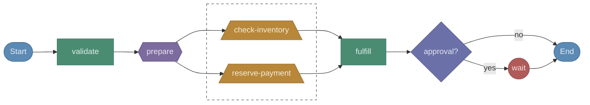

# durable-viz

[](https://www.npmjs.com/package/durable-viz)
[](https://opensource.org/licenses/MIT)

Visualize [AWS Lambda Durable Functions](https://docs.aws.amazon.com/lambda/latest/dg/durable-functions.html) workflows. Static analysis turns your handler code into a flowchart, no deployment or execution required.

Supports **TypeScript/JavaScript**, **Python**, and **Java** runtimes.



## Quick Start

```shell
npx durable-viz handler.ts --open
```

This parses the handler, extracts the workflow structure, and opens an interactive diagram in your browser with scroll zoom, click-drag panning, direction toggle, source view, and a dark theme.

## Usage

```
Usage: durable-viz [options] <file>

Arguments:
  file                   Path to a durable function handler file

Options:
  -d, --direction <dir>  Graph direction: TD (top-down) or LR (left-right) (default: "TD")
  -n, --name <name>      Override the workflow name
  --json                 Output the raw workflow graph as JSON
  -o, --open             Open the diagram in your browser
  -V, --version          Output the version number
  -h, --help             Display help
```

## Output Formats

**Mermaid** (default) prints Mermaid flowchart syntax to stdout. Paste into GitHub Markdown, Notion, or any Mermaid-compatible renderer.

```shell
durable-viz handler.ts
```

**Browser** generates a self-contained HTML file and opens it.

```shell
durable-viz handler.ts --open
```

**JSON** outputs the raw workflow graph for custom tooling.

```shell
durable-viz handler.ts --json
```

## Supported Primitives

Java SDK support is in preview with some primitives still in development.

| Primitive | TypeScript | Python | Java (preview) |
| --- | --- | --- | --- |
| Step | `context.step()` | `context.step()` | `ctx.step()` |
| Invoke | `context.invoke()` | `context.invoke()` | `ctx.invoke()` |
| Parallel | `context.parallel()` | `context.parallel()` | *in development* |
| Map | `context.map()` | `context.map()` | *in development* |
| Wait | `context.wait()` | `context.wait()` | `ctx.wait()` |
| Wait for Callback | `context.waitForCallback()` | `context.wait_for_callback()` | *in development* |
| Create Callback | `context.createCallback()` | `context.create_callback()` | `ctx.createCallback()` |
| Wait for Condition | `context.waitForCondition()` | `context.wait_for_condition()` | *in development* |
| Child Context | `context.runInChildContext()` | `context.run_in_child_context()` | `ctx.runInChildContext()` |

## VS Code Extension

Also available as a VS Code extension with an interactive side panel, click-to-navigate, and auto-refresh on save.

[Install from VS Code Marketplace](https://marketplace.visualstudio.com/items?itemName=gunnargrosch.durable-viz)

## Links

- [GitHub Repository](https://github.com/gunnargrosch/durable-viz)
- [AWS Lambda Durable Functions Documentation](https://docs.aws.amazon.com/lambda/latest/dg/durable-functions.html)

## License

MIT
